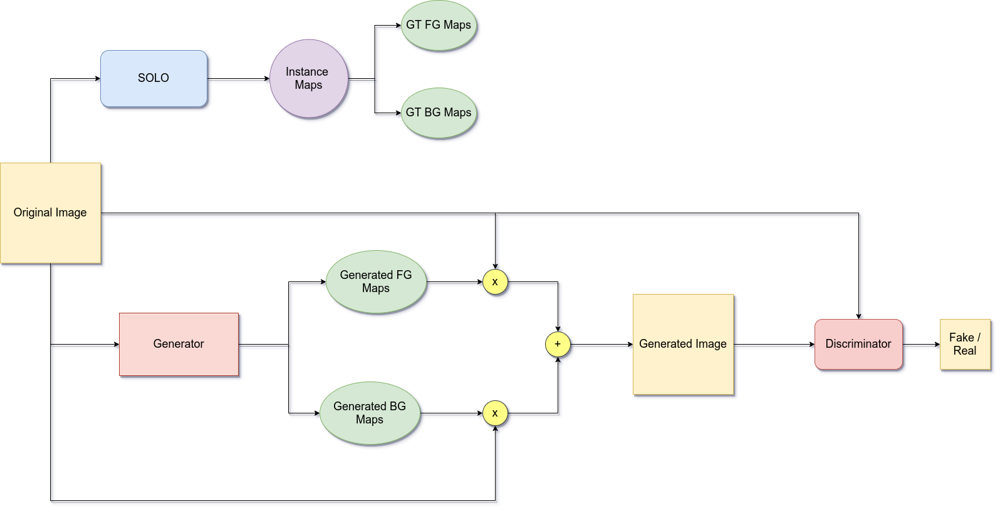

# Object Level Image Editor (OLIE)

[](https://opensource.org/licenses/BSD-2-Clause)
[](https://pytorch.org/)

This code is derived from the [AdelaiDet Project](https://github.com/aim-uofa/AdelaiDet.git)

## Contents
1. [Overview](#1-overview)
2. [Setup Instructions](#2-setup-instructions)
3. [Repository Overview](#3-repository-overview)
4. [Reproduction](#4-reproduction)
4. [Experiments](#5-experiments)

## 1. Overview

This repo contains code for a [SOLOv2](https://arxiv.org/abs/2003.10152) based **O**bject **L**evel **I**mage **E**ditor.

OLIE aims to reconstruct the original image with the objects removed (editing) by incorporating the mask features (produced by SOLOv2) as input to the reconstructor.



## 2. Setup Instructions

- First install Detectron2 following the official guide: [INSTALL.md](https://github.com/facebookresearch/detectron2/blob/master/INSTALL.md).
*Please use Detectron2 with commit id [9eb4831](https://github.com/facebookresearch/detectron2/commit/9eb4831f742ae6a13b8edb61d07b619392fb6543) if you have any issues related to Detectron2.*

- Then build the project with:

```
git clone https://github.com/praeclarumjj3/OLIE.git
cd OLIE
python setup.py build develop
```

- Download the MS-COCO dataset:
```
wget http://images.cocodataset.org/zips/train2017.zip
wget http://images.cocodataset.org/zips/val2017.zip
wget http://images.cocodataset.org/annotations/annotations_trainval2017.zip
```

- Unzip the files according to the following structure

```
OLIE
├── datasets
│   ├── coco
│   │   ├── annotations
│   │   ├── train2017
│   │   ├── val2017
```

- Download Pretrained weights (based on Resnet-50):

```
wget https://cloudstor.aarnet.edu.au/plus/s/chF3VKQT4RDoEqC/download -O SOLOv2_R50_3X.pth
```

```
wget https://cloudstor.aarnet.edu.au/plus/s/9w7b3sjaXvqYQEQ -O SOLOv2_R101_3X.pth
```

Name | inf. time | train. time | Mem | box AP | mask AP | download
--- |:---:|:---:|:---:|:---:|:---:|:---:
[SOLOv2_R50_3x](R50_3x.yaml) | 47ms | ~25h(36 epochs) | 3.7GB  | -  | 37.6  | [model](https://cloudstor.aarnet.edu.au/plus/s/chF3VKQT4RDoEqC/download)
[SOLOv2_R101_3x](R101_3x.yaml) | 61ms | ~30h(36 epochs) | 4.7GB | -   | 39.0  | [model](https://cloudstor.aarnet.edu.au/plus/s/9w7b3sjaXvqYQEQ)

## 3. Repository Overview

The repository is structured as follows:

- `adet` - Base code from the AdelaiDet repo.
- `configs` - Configuration files for SOLOv2.
- `datasets` - Dataset related scripts.
- `modules` - Contains scripts for different modules.

## 4. Reproduction

- Run the following command to run a demo and see visualization results:

```
sh demo.sh
```

- Run the following command to train the **OLIE** model for `30 epochs`:

```
sh train.sh
```

- Run the following command to start distributed training of the **OLIE** model for `30 epochs`:

```
sh dist_train.sh
```

- Run the following command to evaluate the **OLIE** model from checkpoints:

```
sh evaluate.sh
```

## 5. Experiments

- The input image is of the `BGR` format.

- The model was trained for `30 Epochs` with `lr=1e-3` and `L1 Loss`. All experiments were conducted on the `coco-val dataset`. You can see the loss plots in the `losses` folder.

| Phase | Loss |
|-------|------|
| Train | 8e-3 |
| Eval  | 4e-3 |

### Results

- The reconstructions produced are very similar to the input images.
    - **Left**: Original Input
    - **Right**: Reconstruction


